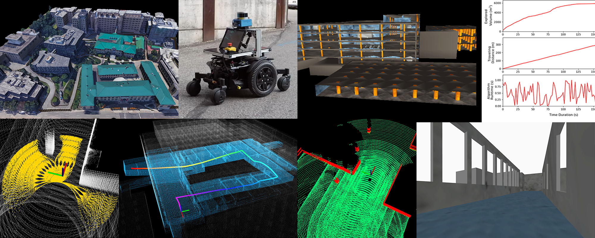

# Waypoint-Based 3D Navigation for ROS Robots

This repository provides a comprehensive solution for developing and deploying 3D waypoint-based autonomous navigation systems using ROS. It is particularly suited for ground-based robots, enabling advanced capabilities such as collision avoidance, terrain traversability analysis, waypoint following, and visualization in simulation environments.

<div align="center">
  
</div>

---

## Features

* **3D Waypoint Navigation:** Navigate autonomously in complex environments.
* **Collision Avoidance:** Robust obstacle avoidance mechanism.
* **Terrain Traversability:** Assess and navigate diverse terrains effectively.
* **Simulation Environments:** Multiple pre-configured simulation scenarios.
* **Real-World Deployment:** Seamlessly transition from simulation to actual robots.
* **Visualization Tools:** Integrated tools for monitoring and analyzing navigation.

---

## Compatibility

* **OS:** Ubuntu 18.04
* **ROS Version:** ROS Melodic

---

## Installation

### Install Dependencies

Update package lists and install required libraries:

```bash
sudo apt update
sudo apt install libusb-dev
```

### Clone the Repository

```bash
git clone https://github.com/HongbiaoZ/autonomous_exploration_development_environment.git
cd waypoint-based-3D-navigation-in-ros
```

### Build the ROS Workspace

```bash
catkin_make
```

### Download Simulation Environments

Run the provided script to download (\~500MB):

```bash
./src/vehicle_simulator/mesh/download_environments.sh
```

*If the script does not initiate downloads, manually download and extract the environments into `src/vehicle_simulator/meshes`.*

---

## Launching the System

Source the workspace and launch the main simulation environment:

```bash
source devel/setup.sh
roslaunch vehicle_simulator system_garage.launch
```

---

## Sending Waypoints

### Using RViz Interface

1. Click the **Waypoint** button in RViz.
2. Select a reachable point near the vehicle.
3. The vehicle autonomously navigates to the chosen waypoint, avoiding obstacles.

### Using ROS Nodes

Alternatively, send a sequence of waypoints programmatically:

In another terminal:

```bash
source devel/setup.sh
roslaunch waypoint_example waypoint_example_garage.launch
```

This ROS node includes navigation boundaries and speed control, guiding the vehicle smoothly through multiple waypoints.

<div align="center">
  
</div>

---

## Acknowledgement 
We sincerely thank the developers and contributors of [Autonomous Exploration Development Environment by CMU](https://github.com/HongbiaoZ/autonomous_exploration_development_environment).
